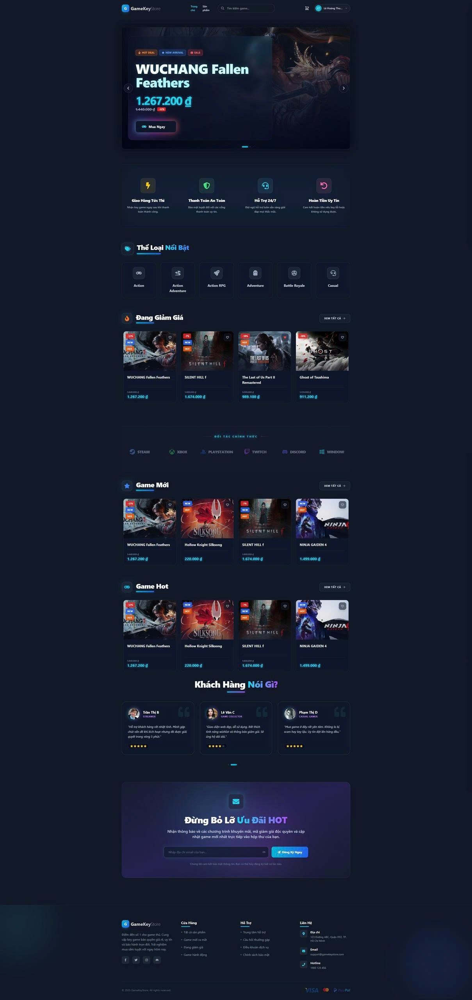
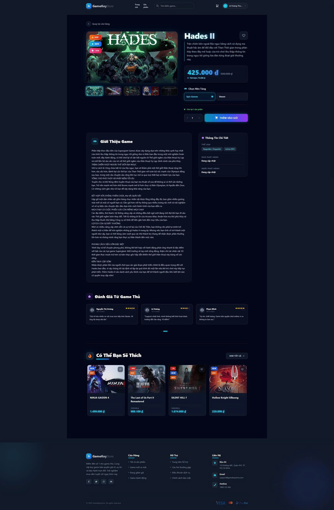

# 🎮 Game Key Store

> Một nền tảng thương mại điện tử chuyên nghiệp cung cấp bản quyền game chính hãng từ Steam, Epic, Origin... với trải nghiệm mua sắm mượt mà, thanh toán an toàn và nhận key tức thì.


---

## ✨ Tính Năng Nổi Bật

### 👤 Đối với Khách hàng (User)
* **🔐 Authentication Tiện Lợi:** 
  * Đăng ký/Đăng nhập bảo mật (Email & Mật khẩu).
  * Đăng nhập nhanh chóng, hiện đại bằng **Google**.
* **🔍 Tìm kiếm & Lọc Thông Minh:** 
  * Tìm kiếm game realtime (Debounce search).
  * Bộ lọc đa dạng: Theo Giá, Thể loại (Action, RPG...), Nền tảng (Steam, Epic, Origin...).
* **🛒 Giỏ hàng Cá nhân hóa:** 
  * Thêm/Sửa/Xóa sản phẩm dễ dàng.
  * Tự động tính toán tổng tiền và cập nhật trạng thái.
* **💳 Thanh toán An toàn:** 
  * Tích hợp cổng thanh toán **VNPay** uy tín.
  * Hỗ trợ đa dạng: Thẻ ATM, QR Code, Ví điện tử.
* **⚡ Giao hàng Tự động (Auto-delivery):** 
  * Hệ thống tự động gửi Key game bản quyền qua **Email** ngay lập tức sau khi thanh toán thành công.
* **👤 Quản lý Tài khoản:** 
  * Xem lại lịch sử đơn hàng chi tiết.
  * Kho Key cá nhân 
  * Cập nhật thông tin, đổi mật khẩu.

### 🛡️ Đối với Quản trị viên (Admin)
* **📊 Dashboard Trực quan:** 
  * Biểu đồ thống kê doanh thu, số lượng đơn hàng, lượng người dùng mới theo thời gian thực.
* **🎮 Quản lý Sản phẩm:** 
  * Thêm mới, chỉnh sửa, xóa game.
  * Quản lý hình ảnh, giá bán, mô tả chi tiết.
* **🗝️ Quản lý Kho Key (Inventory):** 
  * Import key cho từng game.
  * Theo dõi trạng thái key chính xác (Sold/Available).
* **📦 Quản lý Đơn hàng:** 
  * Tra cứu chi tiết giao dịch.
  * Kiểm soát trạng thái thanh toán và giao hàng.

---

## 📸 Giao Diện Minh Họa

### Trang Chủ


### Cửa Hàng


### Chi Tiết Game


---

## 🛠️ Công Nghệ Sử Dụng

### Frontend (Client-side)
Dự án sử dụng các công nghệ hiện đại nhất để đảm bảo hiệu năng và trải nghiệm người dùng:
* **React.js:** Thư viện UI cốt lõi.
* **Redux Toolkit:** Quản lý Global State hiệu quả (Cart, User, Products).
* **Tailwind CSS:** Framework CSS utility-first giúp thiết kế giao diện nhanh chóng, chuẩn responsive.
* **Axios:** Xử lý các HTTP Request tối ưu.
* **React Router DOM:** Quản lý điều hướng SPA (Single Page Application).

### Backend (Server-side)
Hệ thống Backend mạnh mẽ, bảo mật và dễ dàng mở rộng:
* **Node.js & Express.js:** Nền tảng xây dựng RESTful API tốc độ cao.
* **MongoDB & Mongoose:** Cơ sở dữ liệu NoSQL linh hoạt cùng ODM mạnh mẽ.
* **JWT (JSON Web Token):** Cơ chế xác thực và phân quyền (Authorization) chuẩn công nghiệp.
* **Nodemailer:** Dịch vụ gửi email giao key tự động.
* **VNPay API:** Tích hợp thanh toán trực tuyến an toàn.

---

## 🚀 Cài đặt và Chạy dự án

### Yêu cầu tiên quyết
* Node.js (v14.0 trở lên)
* MongoDB (Local hoặc Atlas)

### 1. Clone dự án
```bash
git clone https://github.com/your-username/game-key-store.git
cd game-key-store
```

### 2. Cài đặt Backend
```bash
cd game-key-store-be
npm install
# Tạo file .env và cấu hình (DB_URL, JWT_SECRET, EMAIL_USER, VNPAY_CONFIG...)
npm start
```

### 3. Cài đặt Frontend
```bash
cd game-key-store-fe
npm install
npm start
```

---

## 📞 Liên hệ
Nếu bạn có bất kỳ câu hỏi nào, hãy liên hệ với chúng tôi:
* Email: lehoangthuan4568@gmail.com


---
*© 2024 Game Key Store. All rights reserved.*
